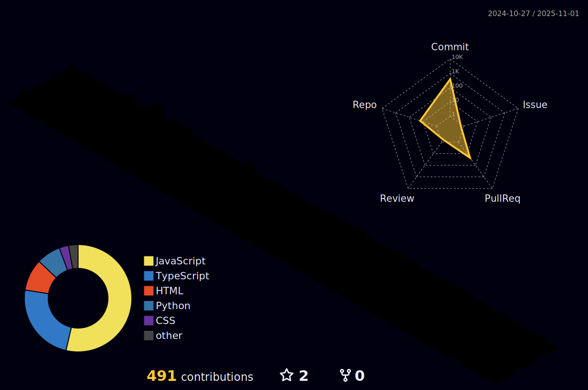

 

 

 <picture> <source media="(prefers-color-scheme: dark)" srcset="https://raw.githubusercontent.com/Gian-vie/Gian-vie/output/github-contribution-grid-snake-dark.svg">  </picture>

  
 |  |  |  
 | ----------- | ----------- |

 
  

   

  

##

[//]: # (  
 )
[//]: # (      )
[//]: # (  
 )

  
 
